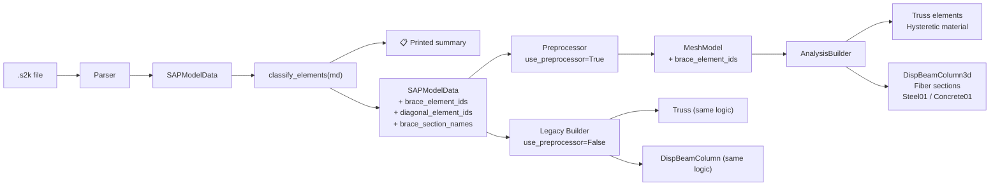

# Element Classification

Before any analysis runs, every frame element in the model needs to be
classified as a **beam**, **column**, or **brace**.  This classification
determines how the element is modelled (elastic, fibre-section, or truss),
which analysis settings apply (P-Delta, solver tolerances), and how
results are post-processed.

## Principles

1. **Classification happens once**, immediately after parsing the `.s2k`
   file, and is stored as first-class data on the model — not buried in
   report-script config dicts.

2. **Two independent signals** feed into the classification:
   - **Section type** — does the section look like a brace section?
     (Pipe, Angle, Double Angle, Tee, Channel)
   - **Geometry** — does the element's chord angle indicate a diagonal
     orientation?  (Angle from vertical > ~20°)

3. **Both signals are visible** in a printed summary so the user can
   verify the classification before running analyses.  Mismatches
   (e.g. a diagonal PipeSection that should NOT be a brace) are
   caught early.

4. **The same classification feeds both v1 and v2 paths** — no config
   drift between legacy and two-stage workflows.

## Data flow



## Classification logic

### Section-based detection

A section is classified as a "brace section" if its Python type is one
of the recognised brace-section dataclasses:

| Section type | Typical use |
|---|---|
| `PipeSection` | Circular hollow section — diagonal bracing |
| `AngleSection` | Single angle — cross-bracing / chevron |
| `DoubleAngleSection` | Double angle — heavier bracing |
| `TeeSection` | Tee — light bracing / girts |
| `ChannelSection` | Channel — light bracing / purlins |

This list is defined in `Selection.from_brace_sections()` in
`src/fea_toolkit/model/selection.py`.

### Geometry-based detection

An element is geometrically diagonal if the angle between its chord
(straight line from node-i to node-j) and the global vertical (Z-axis)
exceeds a threshold (default **20°**).

```
angle_from_vertical = arccos(|Δz| / length) × 180/π

if angle_from_vertical > DIAGONAL_ANGLE_THRESHOLD:
    → diagonal
```

This catches braces that use generic I-sections (e.g. UC sections used
as diagonals in an industrial building).

### Merge rule

A frame element is treated as a **brace** when both conditions hold:

- Its section name is in `brace_section_names` (section-type match), AND
- It is geometrically diagonal (chord angle from vertical > ~20°)

```
is_brace = sec_name in brace_section_names and is_diagonal
```

The two-signal approach prevents false positives:
- A horizontal pipe (handrail, service duct) is **not** a brace — not diagonal.
- A vertical tee (stiffener, girt) is **not** a brace — not diagonal.

### Manual override by element ID

Some elements are structural braces but fall outside the automatic
detection rules.  Examples:

| Case | Why it is missed | How to fix |
|---|---|---|
| **Buckling-restrained brace (BRB)** | May use a custom section (e.g. `RectangularSection`) that is not in `brace_section_names` | Explicitly add its element ID |
| **Diagonal I-section brace** | The section is an `ISection` (not a brace shape), but it functions as a diagonal brace | Explicitly add its element ID |
| **Vertical brace** | A brace that runs nearly vertical (e.g. in a wall panel) falls below the diagonal angle threshold | Explicitly add its element ID |
| **Horizontal tie** | A horizontal strut in a diaphragm that functions as a brace but isn't diagonal | Explicitly add its element ID |

The override replaces the automatic brace set entirely:

```python
from fea_toolkit.model.selection import Selection

# After parsing, before building:
sel = Selection.from_brace_sections(md)
brace_ids = sel.get_frame_ids(md)

# ── Override for special cases ─────────────────────────────────
# Add BRB elements (they use a custom rectangular section)
brace_ids |= {"203", "207", "211"}

# Remove false positives (e.g. a horizontal pipe handrail)
brace_ids -= {"45"}

# Store on the model for all downstream consumers
md.brace_element_ids = brace_ids
```

When `md.brace_element_ids` is set, it takes precedence over the
automatic section-type-plus-geometry detection:

```python
if hasattr(md, 'brace_element_ids') and md.brace_element_ids:
    is_brace = elem_id in md.brace_element_ids
else:
    is_brace = sec_name in brace_section_names and is_diagonal
```

This means the override can be applied once — in the user's report
script — and it flows through to both the legacy Builder and the
two-stage Preprocessor + AnalysisBuilder paths.

### Section-name override

If all elements using a particular section name should be braces
(e.g. a custom "BRB-100" section), add its name to the brace set:

```python
sel = Selection.from_brace_sections(md)
brace_ids = sel.get_frame_ids(md)

# Add all elements with a custom brace section
extra_secs = {"BRB-100", "BRB-150", "GUSSET-PLATE"}
for eid, sec_name in md.frame_assignments.items():
    if sec_name in extra_secs:
        brace_ids.add(eid)

md.brace_element_ids = brace_ids
```

## Printed summary

After `classify_elements(md)` runs, a table is printed so the user
can verify the result:

```
Model element summary
═══════════════════════════════════════
Total frame elements:  432
─────────────────────────────────────
Beams:                210  (48.6%)
Columns:              200  (46.3%)
Braces:                22  ( 5.1%)

Braces identified by:
  Section type only:   10  (PipeSection × 10)
  Geometry + section:  12  (diagonal I-sections in brace bay)

Diagonal elements (not braces): 0
  (elements >20° from vertical whose section is not a named brace type)
─────────────────────────────────────
```

This gives the user immediate confidence that the model is correctly
configured before analysis begins.

## How the classification flows through the build

### SAPModelData → Preprocessor → MeshModel

The Preprocessor receives the classified `SAPModelData` and carries
`brace_element_ids` forward into the `MeshModel`:

```python
@dataclass
class MeshModel:
    # ... existing fields ...
    brace_element_ids: Set[str] = field(default_factory=set)
```

### MeshModel → AnalysisBuilder

The AnalysisBuilder reads `mesh_model.brace_element_ids` during
`_create_elements()` to decide which elements become `Truss` elements:

```python
def _add_beam_column(self, elem, tag, elements, assignments):
    # ...
    if (self.config.get('brace_truss')
            and elem.elem_id in self.mesh_model.brace_element_ids):
        # Create Truss element with Hysteretic material
        mat_tag = self._truss_mat_tags[sec_name]
        A = self._truss_areas[sec_name]
        ops.element('Truss', tag, ni.node_tag, nj.node_tag, A, mat_tag)
        return
    # ... create beam-column as normal ...
```

This is the same logic used by the legacy Builder, but driven by the
persistent `brace_element_ids` set instead of a runtime
`Selection.from_brace_sections()` call.

### Analysis types and their treatment of braces

| Analysis type | Brace treatment | Beam/column treatment |
|---|---|---|
| **Modal** (elastic) | `elasticBeamColumn` (linear) | `elasticBeamColumn` (linear) |
| **Static** (elastic) | `elasticBeamColumn` (linear) | `elasticBeamColumn` (linear) |
| **Response spectrum** | `elasticBeamColumn` (linear) | `elasticBeamColumn` (linear) |
| **Pushover** (steel) | `Truss` + `Hysteretic` (nonlinear) | `DispBeamColumn3d` + `Steel01` fibre (nonlinear) |
| **Pushover** (RC) | Tcl export for Xara | Tcl export for Xara |

In elastic analyses (modal, static, RS), braces use `elasticBeamColumn`
like everything else — they contribute stiffness but don't yield.
Nonlinearity is reserved for the pushover rebuild.

## Standard workflow for steel models

```
1.  Parse .s2k → SAPModelData
2.  classify_elements(md)           → prints summary, sets md.brace_element_ids
3.  Optional: override brace IDs    → md.brace_element_ids = {...}
4.  Build:
      Preprocessor(config).run(md)  → MeshModel (with brace_element_ids)
      AnalysisBuilder(mesh, config) → OpenSees domain
5.  Elastic analyses:
      run_modal_analysis()
      run_static_analysis()
      run_response_spectrum_analysis()
6.  Pushover (automatic rebuild with fibre sections):
      run_pushover_analysis(
          gravity_patterns=...,
          lateral_load_type='uniform',
          brace_truss=True,          ← reads mesh.brace_element_ids
      )
      → DispBeamColumn3d + Steel01 fibres for beams/columns
      → Truss + Hysteretic for braces
```

## Standard workflow for RC models

The OpenSeesPy build (`AnalysisBuilder`) is used only for **elastic**
analyses (modal, static, RS).  For nonlinear pushover, the model is
exported to Tcl and run via Xara's standalone `tclsh8.6`:

```
1.  Parse .s2k → SAPModelData
2.  classify_elements(md)
3.  Build:
      Preprocessor(config).run(md)  → MeshModel
      AnalysisBuilder(mesh, config) → OpenSees domain (elastic only)
4.  Elastic analyses in Python
5.  Export to Tcl:
      builder.export_model_to_tcl("pushover.tcl", create_fiber_sections=True)
      → Generates Concrete01/Steel02 fibre sections
      → Uses forceBeamColumn with HingeRadau integration
      → Sets PDelta geometry for braces
6.  Run via Xara:
      subprocess.run(["tclsh8.6", "pushover.tcl"])
7.  Parse Tcl output → results dict
```

This separation exists because Concrete01/02 fibre sections are
unreliable in OpenSeesPy but work correctly in the Xara/OpenSeesRT
environment.

## Future enhancements

### Stiffness factor per element type

Once each element has a persistent `element_type` label
(`beam`/`column`/`brace`), stiffness modifiers can be applied
selectively:

```python
config = {
    "stiffness_factors": {
        "beam":   0.50,   # cracked section per ASCE 41
        "column": 0.70,
        "brace":  1.00,
    }
}
```

The Preprocessor already supports this via `frame_element_types` and
`_classify_element_type()`.  The classification doc would be the source
of truth for which type each element gets.

### P-Delta per element type

The same classification can control which elements use `PDelta` vs
`Linear` geometric transformations:

```python
config = {
    "geom_transf_type": {
        "beam":   "Linear",
        "column": "PDelta",
        "brace":  "PDelta",
    }
}
```

### Pushover algorithm per element type

Braces often need different solver settings (tighter tolerances,
ModifiedNewton, smaller sub-steps) than beams/columns.  The
classification makes this straightforward.
