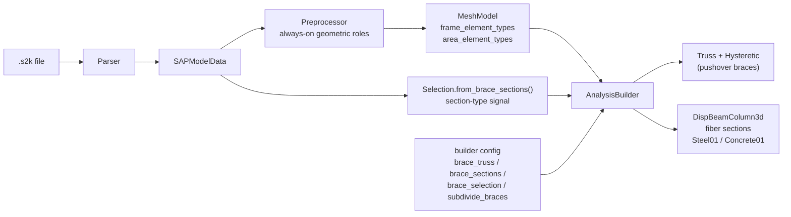

# Element Classification

Before any analysis runs, every frame element in the model needs to be
classified as a **beam**, **column**, or **brace**.  This classification
determines how the element is modelled (elastic, fibre-section, or truss),
which analysis settings apply (P-Delta, solver tolerances), and how
results are post-processed.

## Principles

1. **Classification happens once**, during preprocessing, and is stored as
   first-class data on the `MeshModel` (`frame_element_types` /
   `area_element_types`) — not buried in report-script config dicts.

2. **Two independent signals** feed into the classification:
   - **Section type** — does the section look like a brace section?
     (`Selection.from_brace_sections()`: Pipe, Angle, Double Angle, Tee,
     Channel)
   - **Geometry** — the **always-on** geometric role
     (`Preprocessor._classify_element_type`: beam / column / brace / slab
     / wall, from the chord spans and configurable thresholds — see
     *Classification logic* below)

3. **Both signals are visible** in a printed summary so the user can
   verify the classification before running analyses.  Mismatches
   (e.g. a diagonal PipeSection that should NOT be a brace) are
   caught early.

4. **The same classification feeds both v1 and v2 paths** — no config
   drift between legacy and two-stage workflows.

## Data flow



## Classification logic

### Section-based detection

A section is classified as a "brace section" if its Python type is one
of the recognised brace-section dataclasses:

| Section type | Typical use |
|---|---|
| `PipeSection` | Circular hollow section — diagonal bracing |
| `AngleSection` | Single angle — cross-bracing / chevron |
| `DoubleAngleSection` | Double angle — heavier bracing |
| `TeeSection` | Tee — light bracing / girts |
| `ChannelSection` | Channel — light bracing / purlins |

This list is defined in `Selection.from_brace_sections()` in
`src/fea_toolkit/model/selection.py`.

### Geometry-based detection

A frame element is classified geometrically by comparing its vertical span
`dz = |Δz|` with its horizontal span `dh = √(dx² + dy²)`:

* **column** — `dz > column_vertical_ratio × max(dh, classification_span_floor)`
  (near-vertical).  The default ratio `4.0` is equivalent to a chord angle
  within `atan(1/4) ≈ 14°` of vertical.
* **brace** — `dh > classification_span_floor` **and** `dz > classification_span_floor`
  (diagonal — significant spans in both the vertical and horizontal
  directions).
* **beam** — otherwise (horizontal or near-horizontal).

This catches diagonals that use generic I-sections (e.g. UC sections used
as braces in an industrial building).

The thresholds are **configurable** via the Preprocessor `config` dict
(defaults preserve the historical behaviour):

| Key | Default | Meaning |
|---|---|---|
| `column_vertical_ratio` | `4.0` | column iff `dz > ratio × max(dh, floor)` (≈14° from vertical) |
| `classification_span_floor` | `0.01` | span floor for the column and brace rules |
| `slab_z_tolerance` | `0.02` | area horizontality tolerance (slab vs wall) |

The geometric classification is **always-on**: it runs for every
non-inactive element at preprocess time (not only when
`stiffness_factors` is configured) and is stored on the `MeshModel` as
`frame_element_types` / `area_element_types`.  `AnalysisBuilder`
consumes these for stiffness-factor section variants and element-property
role defaults.

### The brace decision (section-type signal, geometry gate + overrides)

For the steel pushover, whether a frame element is modelled as a **brace**
(`Truss` + `Hysteretic`) is decided from the section-type signal, the
always-on geometric role, and the explicit overrides:

1. **Section type** — a section is a recognised brace section if it is a
   `PipeSection`, `AngleSection`, `DoubleAngleSection`, `TeeSection` or
   `ChannelSection` (the same list exposed by
   `Selection.from_brace_sections()`).
2. **Geometry gate (default)** — with no explicit override, the
   section-type signal only turns an element into a brace when its
   geometric role (`frame_element_types[eid]`) is also `'brace'`.  A
   horizontal pipe (handrail, service duct) or a vertical tee (stiffener,
   girt) is geometrically a beam/column and stays flexural (beam-column
   element), even though its section is a recognised brace shape.
3. **Section-name override** — `config["brace_sections"] = ["BRB-100", ...]`
   replaces the type check: every element using one of those section names
   is a brace (the override is explicit, so it is not subject to the
   geometric-role gate).
4. **Per-element override** — `AnalysisBuilder.set_brace_selection({...})`
   (or the `brace_selection` argument of `rebuild_with_fiber_sections`)
   is authoritative: the elements in the set become braces regardless of
   section type or geometry (custom BRBs, diagonal I-section braces), and
   it enables `subdivide_braces` (Approach A subdivision with an initial
   imperfection, so buckling develops under compression).

### Manual override by element ID

Some elements are structural braces but fall outside the section-type
detection.  Examples:

| Case | Why it is missed | How to fix |
|---|---|---|
| **Buckling-restrained brace (BRB)** | Uses a custom section (e.g. `RectangularSection`), not a recognised brace type | `set_brace_selection({...})` / `brace_selection` |
| **Diagonal I-section brace** | The section is an `ISection` (not a brace shape), but it functions as a diagonal brace | `set_brace_selection({...})` / `brace_selection` |
| **Vertical brace** | Near-vertical brace (e.g. in a wall panel) — no diagonal span | `set_brace_selection({...})` / `brace_selection` |
| **Horizontal tie** | A horizontal strut that works axially but isn't diagonal | `set_brace_selection({...})` / `brace_selection` |

The per-element override is applied on the `AnalysisBuilder` (it matters
for the pushover rebuild — braces stay elastic in modal/static/RS):

```python
from fea_toolkit.model.selection import Selection

# The section-type signal, as a Selection (for inspection / reuse):
sel = Selection.from_brace_sections(md)
brace_ids = set(sel.get_frame_ids(md))

# ── Override for special cases ─────────────────────────────────
brace_ids |= {"203", "207", "211"}   # add BRB elements
brace_ids -= {"45"}                  # drop false positives

# Pushover rebuild: braces → Truss + Hysteretic, subdivided with
# an initial imperfection so buckling develops (Approach A).
builder.rebuild_with_fiber_sections(brace_selection=brace_ids)
```

The override lives on the builder (`_brace_selection`), not on the model:
the `SAPModelData`/`MeshModel` carry the always-on geometric roles
(`frame_element_types`), and `Selection.from_brace_sections()` remains
available anywhere for the section-type signal.

### Section-name override

If all elements using a particular section name should be braces
(e.g. a custom "BRB-100" section), name it in the builder config:

```python
cfg = {
    # ... builder config ...
    "brace_truss": True,                      # braces → Truss + Hysteretic
    "brace_sections": ["BRB-100", "BRB-150", "GUSSET-PLATE"],
}
builder = AnalysisBuilder(mesh_model, cfg)
```

`brace_sections` replaces the type-based check (`PipeSection`/`AngleSection`/
etc.) for the brace→Truss path: every element whose section name is listed
becomes a brace.  Because it is an explicit override, it is **not** gated
by the geometric role (unlike the type-based default signal) — an explicit
`"GUSSET-PLATE"` selection applies even if that element is horizontal.

## Verification & diagnostics

Classification is stored on the `MeshModel`, so the roles are always
inspectable without a separate `classify_elements()` pass or printed
summary table:

```python
mm = preprocess_model(md, config)
print(mm.frame_element_types)   # eid -> 'beam' / 'column' / 'brace'
print(mm.area_element_types)    # aid -> 'slab' / 'wall'
```

The section-type signal is queryable with a `Selection`:

```python
from fea_toolkit.model.selection import Selection
brace_ids = set(Selection.from_brace_sections(md).get_frame_ids(md))
```

The `AnalysisBuilder` consumes the geometric roles for stiffness-factor
section variants and element-property role defaults; the pushover
brace→Truss decision is driven by `brace_truss` + `brace_sections` /
`brace_selection` (see above).

## How the classification flows through the build

### SAPModelData → Preprocessor → MeshModel

The Preprocessor assigns the geometric role for every non-inactive element
during `run()` and stores it on the `MeshModel`:

```python
# MeshModel fields
frame_element_types: dict[str, str]   # eid -> 'beam' / 'column' / 'brace'
area_element_types: dict[str, str]    # aid -> 'slab' / 'wall'
```

### MeshModel → AnalysisBuilder

The `AnalysisBuilder` consumes the roles for per-type section variants
(stiffness factors) and element-property role defaults
(`element_strategies`).  The pushover brace→Truss decision is made in
`_add_beam_column` from the geometric role gated by the section signal,
with explicit overrides taking precedence:

```python
if self.config.get("brace_truss"):
    if self._brace_selection is not None:
        # Explicit per-element selection is authoritative.
        is_brace = (
            elem.elem_id in self._brace_selection
            or getattr(elem, "parent_id", None) in self._brace_selection
        )
    else:
        # Default: recognised brace section AND geometric role 'brace'
        # (horizontal pipes / ordinary beams stay flexural).  An explicit
        # brace_sections name skips the geometry gate.
        explicit_sec = self.config.get("brace_sections") is not None
        is_brace = sec_name in self._truss_mat_tags and (
            explicit_sec or self._frame_element_types.get(elem.elem_id) == "brace"
        )
    if is_brace:
        # Truss element with a per-element Hysteretic material whose
        # compression branch uses the actual Euler buckling load P_cr.
        ops.element("Truss", tag, ni.node_tag, nj.node_tag, A, mat_tag)
        return
# ... create beam-column as normal ...
```

`_truss_mat_tags` is populated in `_create_truss_materials` from
`brace_sections` (explicit section names) or the recognised brace section
types; sections used by explicitly-selected brace elements are registered
too, so custom BRBs / diagonal I-section braces resolve.

### Analysis types and their treatment of braces

| Analysis type | Brace treatment | Beam/column treatment |
|---|---|---|
| **Modal** (elastic) | `elasticBeamColumn` (linear) | `elasticBeamColumn` (linear) |
| **Static** (elastic) | `elasticBeamColumn` (linear) | `elasticBeamColumn` (linear) |
| **Response spectrum** | `elasticBeamColumn` (linear) | `elasticBeamColumn` (linear) |
| **Pushover** (steel) | `Truss` + `Hysteretic` (nonlinear) | `DispBeamColumn3d` + `Steel01` fibre (nonlinear) |
| **Pushover** (RC) | Tcl export for Xara | Tcl export for Xara |

In elastic analyses (modal, static, RS), braces use `elasticBeamColumn`
like everything else — they contribute stiffness but don't yield.
Nonlinearity is reserved for the pushover rebuild.

## Standard workflow for steel models

```
1.  Parse .s2k → SAPModelData
    (geometric roles are always assigned by the Preprocessor)
2.  Build:
      Preprocessor(config).run(md)  → MeshModel (frame_element_types / area_element_types)
      AnalysisBuilder(mesh, config) → OpenSees domain
3.  Elastic analyses:
      run_modal_analysis()
      run_static_analysis()
      run_response_spectrum_analysis()
4.  Pushover (automatic rebuild with fibre sections + brace trusses):
      cfg["brace_truss"] = True      ← brace-role sections → Truss + Hysteretic
      run_pushover_analysis(gravity_patterns=..., lateral_load_type='uniform')
      # Optional per-element brace overrides (Approach A subdivision):
      builder.set_brace_selection({"B-101", "B-102"})
      → DispBeamColumn3d + Steel01 fibres for beams/columns
      → Truss + Hysteretic for brace-role elements
```

## Standard workflow for RC models

The OpenSeesPy build (`AnalysisBuilder`) is used only for **elastic**
analyses (modal, static, RS).  For nonlinear pushover, the model is
exported to Tcl and run via Xara's standalone `tclsh8.6`:

```
1.  Parse .s2k → SAPModelData
2.  (No manual classification step — the Preprocessor always assigns
    geometric roles)
3.  Build:
      Preprocessor(config).run(md)  → MeshModel
      AnalysisBuilder(mesh, config) → OpenSees domain (elastic only)
4.  Elastic analyses in Python
5.  Export to Tcl:
      builder.export_model_to_tcl("pushover.tcl", create_fiber_sections=True)
      → Generates Concrete01/Steel02 fibre sections
      → Uses forceBeamColumn with HingeRadau integration
      → Sets PDelta geometry for braces
6.  Run via Xara:
      subprocess.run(["tclsh8.6", "pushover.tcl"])
7.  Parse Tcl output → results dict
```

This separation exists because Concrete01/02 fibre sections are
unreliable in OpenSeesPy but work correctly in the Xara/OpenSeesRT
environment.

## Phase 2 — Design roles (planned)

The geometric role answers "where does the member point?".  The **design
role** answers "how is the member designed / modelled?" — and the two are
not the same.  An inclined column is geometrically diagonal but designed as
a compression member; a horizontal tie is geometrically a beam but designed
axially.  This matches the industry pattern (ETABS "Frame Design
Procedure", GSA member type, Robot "Type & Structure Object"): a
geometry-derived **default** that the user can **override**.

### Proposal

* New `MeshModel.frame_design_roles: dict[eid, str]` — values `beam`,
  `column`, `brace`, `tie` (and `none`), populated by the Preprocessor.
* **Default** — the geometric role, refined by the section-shape hint
  (`Selection.from_brace_sections()` seeds `brace`).
* **Override** — the existing Level 1 → 2 → 3 precedence
  (`docs/element_properties_config.md`): per-ID → Selection group → role
  default.
* The **design role**, not the geometric role, drives modelling/design
  consumers.

### First consumer: brace buckling in the steel pushover

Buckling is the defining characteristic of a brace: it fails in
compression by Euler buckling rather than flexural yielding, and that
determines the **modelling choice** in pushover:

| design role | pushover modelling |
|---|---|
| `brace` | `Truss` + `Hysteretic` (asymmetric tension/compression; the compression branch collapses at the buckling load) |
| `tie` | `Truss`, tension-only (or elastic, no compression) |
| `column` | beam-column + fibre (P-M), plus `stiffness_factors` / limit-state springs |
| `beam` | beam-column + fibre (flexure) |

Today the brace set comes from `Selection.from_brace_sections()` gated by
the geometric role, plus the `brace_selection` / `brace_sections` overrides
on the `AnalysisBuilder` (see *The brace decision* above).  Phase 2 would
derive it from a first-class `frame_design_roles['brace']`, keeping the
`brace_selection` per-element override as a back-compat explicit override.
The Approach A/B mechanics (subdivision + imperfection, or truss +
Hysteretic) stay unchanged — only *how the brace set is decided* changes.

### Not started (deliberately)

`frame_design_roles` is intentionally **not implemented yet**.  The steel
pushover is the first genuine consumer; adding the field before wiring a
consumer would be speculative API surface.  Implement it together with the
first consumer.

## Future enhancements

### Stiffness factor per element type

Implemented — with the always-on geometric classification, `stiffness_factors`
applies per-role E-mod modifiers (`beam` / `column` / `brace` / `slab` /
`wall`), creating type-specific section variants consumed by
`AnalysisBuilder`:

```python
config = {
    "stiffness_factors": {
        "beam":   0.50,   # cracked section per ASCE 41
        "column": 0.70,
        "brace":  1.00,
    }
}
```

### P-Delta per element type

The same classification can control which elements use `PDelta` vs
`Linear` geometric transformations:

```python
config = {
    "geom_transf_type": {
        "beam":   "Linear",
        "column": "PDelta",
        "brace":  "PDelta",
    }
}
```

### Pushover algorithm per element type

Braces often need different solver settings (tighter tolerances,
ModifiedNewton, smaller sub-steps) than beams/columns.  The
classification makes this straightforward.
