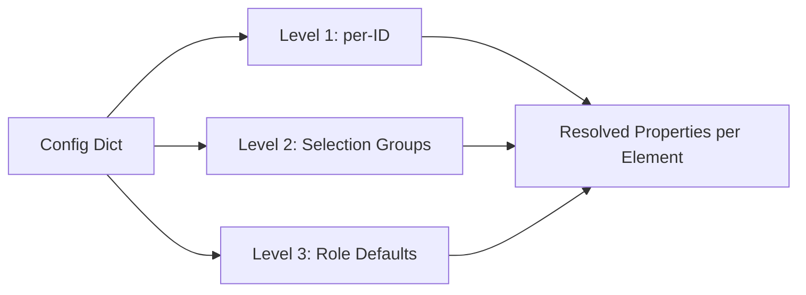

# Element Properties Configuration

This document describes the per-element creation property system — a config-driven approach for controlling how each frame and area element is created in OpenSees, supporting mixed structural systems with different element types, materials, and integration rules per element.

## Overview

The three-level resolution system allows precise control over element creation:

1. **Level 1 — Per-ID overrides** (highest priority)
2. **Level 2 — Selection-based groups** (applies to matching elements)
3. **Level 3 — Role defaults** (based on `frame_element_types` / `area_element_types` classification)



## Dataclasses

### `FrameElementProperties`

| Field | Type | Default | Description |
|---|---|---|---|
| `element_type` | `str` | `"elasticBeamColumn"` | OpenSees element command: `elasticBeamColumn`, `nonlinearBeamColumn`, `dispBeamColumn`, `forceBeamColumn`, `truss` |
| `material_strategy` | `str` | `"elastic"` | Material approach: `elastic`, `fiber_steel`, `fiber_rc`, `steel02` |
| `integration_type` | `Optional[str]` | `None` | Integration rule: `Lobatto`, `Legendre`, `Radau`, `NewtonCotes`, `HingeRadau`, `HingeMidpoint`, `HingeRadauTwo`, `UserHinge` |
| `num_integration_points` | `int` | `0` | Number of integration points (`0` = element default) |
| `hinge_params` | `Optional[dict]` | `None` | Hinge lengths e.g. `{"lpI": 0.1, "lpJ": 0.1}` |

### `AreaElementProperties`

| Field | Type | Default | Description |
|---|---|---|---|
| `element_type` | `Optional[str]` | `"ShellMITC4"` | Shell element: `ShellMITC4`, `ShellDKGQ`, `ShellNLDKGQ`, or `None` for loads-only |
| `material_strategy` | `str` | `"elastic"` | `elastic`, `layered_rc`, `layered_steel` |
| `thickness` | `Optional[float]` | `None` | Thickness override (`None` = use SAP section property) |
| `nd_material_names` | `List[str]` | `[]` | References to nD materials for layered sections |
| `layer_stack` | `List[ShellFiberLayer]` | `[]` | Direct layer definitions (overrides `nd_material_names`) |

## Config Schema

### Frame elements

```python
config = {
    "element_strategies": {
        # ── Defaults per role (Level 3) ──
        "FRAME_BEAM":   {"element": "nonlinearBeamColumn", "material": "fiber_steel",
                         "integration": "Lobatto", "num_int_pts": 5},
        "FRAME_COLUMN": {"element": "nonlinearBeamColumn", "material": "fiber_rc",
                         "integration": "Lobatto", "num_int_pts": 5},
        "BRACE":        {"element": "truss", "material": "steel02"},
        "WALL":         {"element": "ShellNLDKGQ", "material": "layered_rc"},
        "SLAB":         {"element": "ShellMITC4", "material": "elastic"},
    },
    # ── Selection-based groups (Level 2) ──
    "frame_groups": {
        "coupling_beams": {
            "selector": {"sections": ["CB400", "CB500"]},
            "element": "nonlinearBeamColumn", "material": "fiber_steel",
            "integration": "HingeRadau", "num_int_pts": 4,
            "hinge_params": {"lpI": 0.15, "lpJ": 0.15},
        },
        "secondary_beams": {
            "selector": {"sections": ["W8X10", "W8X13"]},
            "element": "elasticBeamColumn", "material": "elastic",
        },
    },
    # ── Per-ID overrides (Level 1) ──
    "frame_overrides": {
        "FRAME-99": {"element": "elasticBeamColumn", "material": "elastic"},
    },
}
```

### Area elements (shells)

```python
config = {
    "nd_materials": {
        "conc_unconfined": {"material_type": "ConcreteS", "fc": 30e6, "ft": 3e6, "E": 30e9, "nu": 0.2},
        "conc_confined":   {"material_type": "ConcreteS", "fc": 40e6, "ft": 4e6, "E": 35e9, "nu": 0.2},
        "rebar_smeared":   {"material_type": "J2PlateFibre", "fy": 400e6, "E": 200e9, "nu": 0.3},
    },
    "shell_layers": {
        # Level 1: per-area-ID
        "AREA-42": {
            "layers": [
                {"thickness": 0.05, "nd_material": "conc_unconfined", "n_ip": 4},
                {"thickness": 0.005, "nd_material": "rebar_smeared", "n_ip": 2},
                {"thickness": 0.30, "nd_material": "conc_confined", "n_ip": 8},
                {"thickness": 0.005, "nd_material": "rebar_smeared", "n_ip": 2},
                {"thickness": 0.05, "nd_material": "conc_unconfined", "n_ip": 4},
            ],
        },
        # Level 2: selection-based
        "wall_core_400": {
            "selector": {"sections": ["WALL400"]},
            "layers": [
                {"thickness": 0.04, "nd_material": "conc_unconfined", "n_ip": 3},
                {"thickness": 0.32, "nd_material": "conc_confined", "n_ip": 8},
                {"thickness": 0.04, "nd_material": "conc_unconfined", "n_ip": 3},
            ],
        },
    },
}
```

## Resolution Order

For each frame element:
1. Check `frame_overrides` for a direct element ID match → use that
2. Check `frame_groups` selections in order → first match wins
3. Check `element_strategies` for the element's role (`FRAME_BEAM`, `FRAME_COLUMN`, `BRACE`)
4. Fall back to `elasticBeamColumn` + `elastic`

For each area element:
1. Check `shell_layers` for an area ID key → use that
2. Check `shell_layers` for a selection key whose `selector` matches → first match wins
3. Check `element_strategies` for the element's role (`WALL`, `SLAB`)
4. Fall back to `ShellMITC4` + `elastic`

## OpenSees nD Material Types

| Type | Description |
|---|---|
| `ElasticIsotropic` | Linear elastic 2D plane-stress |
| `J2PlateFibre` | J2 plasticity with isotropic/kinematic hardening (smeared rebar) |
| `ConcreteS` | Concrete with compressive/tensile strength (fixed crack) |
| `PlateFromPlaneStress` | Wraps a plane-stress material into a plate element |

## Integration Rules

| Integration | Description | Typical use |
|---|---|---|
| `Lobatto` | Gauss-Lobatto (default) | Distributed plasticity |
| `Legendre` | Gauss-Legendre | High-accuracy fiber |
| `Radau` | Gauss-Radau | Mild hinges |
| `NewtonCotes` | Newton-Cotes | Uniform sampling |
| `HingeRadau` | Plastic hinges + elastic mid | Concentrated hinge models |
| `HingeMidpoint` | Hinge + midpoint | Alternative hinge |
| `HingeRadauTwo` | Two-point Radau | Finer hinge |
| `UserHinge` | User-defined lengths | Full control |