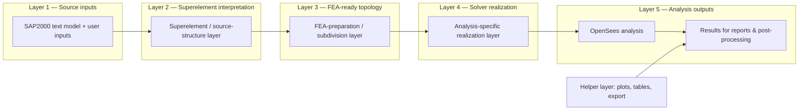

# Layered Analysis Workflow for the v3 Architecture

This note frames the analysis workflow as a layered system in which the SAP2000 model is treated as a source structural description, then progressively converted into a finite-element-ready model and finally into one or more analysis-specific OpenSees models.

## 1. Overall structure

The full workflow is best understood as a sequence of coupled layers:

1. Source model inputs
2. Superelement / source-structure layer
3. FEA-preparation / subdivision layer
4. Analysis-specific realization layer
5. OpenSees execution and results production

The key idea is that the SAP2000 model is not directly an FEA model. It is a high-level structural source representation that must be interpreted, subdivided, connected, and finally realized according to the analysis objective.

## 2. Source model inputs

The starting point is the SAP2000 text model together with user-supplied analysis inputs.

These sources provide:

- geometry and connectivity
- section properties and material definitions
- load definitions and load patterns
- user-defined analysis requirements such as spectra, ground motions, nonlinear settings, or special demand assumptions

At this stage, the information is structural and source-level. It is not yet a discretized finite element model.

## 3. Superelement / source-structure layer

The SAP2000 model is best viewed as a superelement-style source representation.

In this layer:

- the model is still a conceptual structural description
- the geometry is still high-level and may not be directly suitable for finite element analysis
- members, panels and assignments must be interpreted into finite-element-ready entities
- the model is not yet committed to a specific solver formulation

This is the layer of “what the structure is” before it becomes an analysable FE model.

## 4. FEA-preparation / subdivision layer

This layer converts the source structural model into a connected and discretized FEA-ready topology.

Typical operations include:

- splitting members at joints, breaks, or offset locations
- merging coincident nodes
- meshing area elements and shell regions
- introducing rigid links or offset connections
- detecting diaphragms and constraint relationships
- redistributing area loads onto edges or nodes
- subdividing members or braces where needed for a target analysis representation

This is the stage that turns the SAP geometry into a true finite-element topology.

It is also the stage where subdivision decisions can depend on the analysis being carried out. For example:

- brace subdivision for buckling sensitivity
- finer local discretization for nonlinear response
- special node-connection logic for constraint enforcement

## 5. Analysis-specific realization layer

Once the FEA-ready topology exists, the analysis chooses how to realize that geometry in OpenSees.

This layer is where the analysis-specific decisions are made:

- elastic properties may remain close to the SAP values
- nonlinear analyses may require synthetic nonlinear material laws
- fiber sections may be introduced where appropriate
- hinges or lumped plasticity may be inserted
- brace behaviour may be modeled with different formulations
- section and material choices may be modified for specific analysis targets

This means the same prepared topology can support several distinct OpenSees realizations, depending on whether the goal is:

- linear elastic static analysis
- modal analysis
- response-spectrum analysis
- pushover analysis
- nonlinear dynamic analysis

## 6. Runtime core vs helper-consumer layer

The implementation should now be split into two distinct responsibilities.

### 6.1 Canonical repository-owned report entry point

The repository-owned orchestration heart should live in [src/fea_toolkit/report.py](../src/fea_toolkit/report.py), specifically in the shared `generate_report()` / `run_all()`-style flow.

That file is the correct place for the generalised, reusable analysis pipeline because it owns the sequence:

1. parse `SAPModelData`
2. preprocess once into a `MeshModel`
3. create or reuse per-case `AnalysisBuilder` instances
4. run the requested analyses
5. return a result bundle for downstream consumers

The shared `report` package entry point should therefore be the canonical “run all” entry for all repository-supported workflows.

### 6.2 Private local wrappers

Private project-specific drivers, such as those under [local/CLP_BSDG_Latest_Models/Pumphouse](../local/CLP_BSDG_Latest_Models/Pumphouse), should remain thin wrappers.

Their role is not to host the general engine. Instead, they should:

- provide project-specific paths and configuration
- call the shared `generate_report()` entry point
- format or export the results for the local private deliverable only

This allows the repository to keep a general, reusable, commit-worthy report engine while leaving sensitive model-specific files in the private `local` area.

### 6.3 Runtime core

The runtime core owns the structural lifecycle:

- parse source model data
- perform preprocessing once
- create a shared `MeshModel`
- create or reuse a case-specific `AnalysisBuilder`
- execute the analysis case
- return result objects and result dictionaries

This layer should be limited to the canonical runtime files:

- `SAP2000Parser` / `SAPModelData`
- `Preprocessor`
- `MeshModel`
- `AnalysisBuilder`
- `AnalysisManager`
- `AnalysisCaseSpec`

### 6.4 Helper / downstream consumer layer

Helper modules are allowed to exist, but they should consume already-prepared results rather than owning the model lifecycle.

These modules include, for example:

- plotting helpers such as `viz.py` and `report.py`
- report formatting helpers
- Rhino / export helpers
- notebook or Quarto presentation wrappers

Their role is to:

- render figures
- format tables
- export result artefacts
- present results to human-facing tools

They should not be the place where the OpenSees domain is constructed for routine reporting.

## 7. OpenSees execution and results layer

The final stage builds the OpenSees domain and executes the requested analyses.

The outputs are the analysis products that drive the reporting pipeline:

- internal forces
- element forces
- deformations and displacements
- modal properties
- demand/statistical summaries
- post-processed response quantities for reports

These results are then consumed by reporting, visualization, and evaluation workflows.

## 8. Formal layered diagram



## 9. How the current data structures fit into this

The current codebase already maps quite well onto this layered structure.

### SAP source representation

- `SAPModelData`
  - holds the parsed SAP2000 source model data
  - this is the source-level representation of geometry, properties, loads, restraints, and metadata

### Superelement-to-FEA preparation stage

- `Preprocessor`
  - performs topology mutations and prepares a connected, finite-element-ready model
  - this corresponds to the FEA-preparation / subdivision layer

### Shared preprocessed model state

- `MeshModel`
  - stores the shared frozen model state after preprocessing
  - it carries the relevant geometry, section/material catalogue, load definitions, and topology metadata
  - this is the integrated handoff object between preprocessing and analysis

### Analysis-specific realization stage

- `AnalysisBuilder`
  - consumes the `MeshModel`
  - realizes the OpenSees domain for a chosen analysis case
  - this is the layer where element formulation, nonlinear properties, hinge choices, brace strategy, and analysis-specific material decisions are applied

### Multi-analysis orchestration

- `AnalysisManager`
  - manages multiple analysis cases that share the same prepared model state
  - it coordinates dependencies such as modal results feeding a later response-spectrum or pushover workflow

## 10. Practical interpretation

A useful summary is:

- the SAP2000 model is the source superelement description
- the preprocessor is the geometry and topology preparation engine
- the `MeshModel` is the shared preprocessed FE-ready state
- the `AnalysisBuilder` is the analysis-specific OpenSees realization engine
- the analysis manager is the orchestration layer for multiple cases

In short:

- geometry, properties, and loads originate from the SAP source model and user inputs
- the preprocessing stage makes the model suitable for FEA
- the analysis stage decides how those model data are materialized for the OpenSees solver needed by the chosen analysis

## 11. Minimal implementation plan

The minimal strategy is to keep the current architecture and make the ownership of the three domains explicit:

### 11.1 Data ownership

#### Keep in `MeshModel` as the canonical shared state

The `MeshModel` should continue to hold the reusable, preprocessed model state:

- `nodes`
- `frame_elements`
- `frame_assignments`
- `area_elements`
- `area_assignments`
- `frame_dist_loads`
- `edge_loads_from_areas`
- `joint_loads`
- `frame_gravity_loads`
- `area_gravity_loads`
- `area_uniform_loads`
- `load_patterns`
- `mass_sources`
- `materials`
- `sections`
- `restraints`
- `groups`
- `frame_element_types`
- `area_element_types`

This is the canonical structure from which all analyses should start.

#### Keep in `AnalysisBuilder` as the analysis-specific realization layer

The `AnalysisBuilder` should continue to own the analysis-specific choices that change from one case to another:

- `element_type`
- `use_elastic_sections`
- `create_fiber_sections`
- `geom_transf_type`
- `brace_type`
- `beam_integration`
- `solver_*` settings

This is where the builder chooses how the canonical model is turned into an OpenSees domain.

### 11.2 Minimal new or repurposed fields

The following additions are enough to make the workflow explicit without redesigning the whole codebase.

#### Add to `MeshModel`

A small set of optional metadata fields can be added to distinguish canonical data from analysis-specific variants:

- `geometry_variant: Optional[str] = None`
- `analysis_property_overrides: Dict[str, Dict[str, Any]] = field(default_factory=dict)`
- `analysis_load_overrides: Dict[str, Dict[str, Any]] = field(default_factory=dict)`
- `analysis_variant_map: Dict[str, Dict[str, Any]] = field(default_factory=dict)`

These fields would let the same `MeshModel` carry:

- the canonical source-prepared topology
- optional named variants for analysis-specific geometry/property/load behavior
- a lightweight hook for downstream builder selection

#### Repurpose existing fields rather than adding a new schema

The current code already has the correct inheritance pattern:

- `parent_id` / `child_ids` on `FrameElement` and `AreaElement`
- `inactive: bool` on both element dataclasses

This should continue to be used as the representation of a source super-element that has been subdivided into active FE children.

### 11.3 Minimal analysis-case structure

Add one lightweight analysis-case specification object to make the builder workflow explicit:

```python
@dataclass
class AnalysisCaseSpec:
    name: str
    analysis_type: str                  # static, modal, rs, pushover, etc.
    geometry_variant: Optional[str] = None
    property_variant: Optional[str] = None
    load_variant: Optional[str] = None
    config: Dict[str, Any] = field(default_factory=dict)
```

This object can be created by the caller and passed through `AnalysisManager` to `AnalysisBuilder` without changing the overall serialization model.

### 11.4 Where the workflow changes are applied

#### Geometry changes

Perform geometric preparation once in `Preprocessor.run()`.

The geometry should be modified only in these places:

- `Preprocessor` topology preparation
- optional analysis-specific branch selection in `AnalysisBuilder` configuration

For the normal case, geometry should not be rewritten inside each analysis builder. The prepared mesh should be kept stable.

#### Loads changes

Keep the base load catalog in the `MeshModel`.

Apply/load-scale/select the loads in `AnalysisBuilder.create_loads()` using:

- `mesh_model.load_patterns`
- `mesh_model.frame_dist_loads`
- `mesh_model.joint_loads`
- `mesh_model.frame_gravity_loads`
- `mesh_model.area_gravity_loads`
- `mesh_model.area_uniform_loads`

This is the correct place for analysis-specific load scaling, load pattern selection, and case-level pattern activation.

#### Properties changes

Keep the base property catalogue in `MeshModel`.

Create or redefine the actual OpenSees material / section realization in `AnalysisBuilder.build_domain()`.

This is where the builder should switch between:

- elastic section realization
- fiber-section realization
- nonlinear material realization
- hinge / lumped-plasticity realization

### 11.5 Minimal change set

The smallest practical code change set is therefore:

1. Keep `MeshModel` as the canonical shared object.
2. Add optional `analysis_variant_map` and `analysis_*_overrides` metadata to `MeshModel`.
3. Add `AnalysisCaseSpec` to the analysis layer.
4. Keep geometry preparation in `Preprocessor`.
5. Keep load application in `AnalysisBuilder.create_loads()`.
6. Keep property realization in `AnalysisBuilder.build_domain()` and the `AnalysisDefaults` config path.
7. Do not move solver-specific nonlinear material creation into the parser or into a permanent solver-specific `MeshModel` state.

## 12. Impact on the admin v3 workflow

The admin v3 workflow should remain a “parse once, preprocess once, reuse many analyses” flow.

### 12.1 Intended runtime sequence

1. Parse the SAP2000 text model into `SAPModelData`.
2. Perform the model-specific enrichment step (base restraints, supplemental masses, loads-only selection, etc.).
3. Run `Preprocessor.run()` once to create the `MeshModel`.
4. Create one or more `AnalysisCaseSpec` objects for the analysis cases required by the report.
5. Pass the same shared `MeshModel` into `AnalysisBuilder` for each case.
6. Run the builder-specific analysis methods (`run_static_analysis()`, `run_modal_analysis()`, etc.).

### 12.2 What this change means for the admin v3 script

The admin v3 script should not become a geometry builder per analysis case. That would reintroduce the old single-stage inefficiency.

Instead, the script should do the following:

- keep the `SAPModelData` → `MeshModel` preprocessing path as the canonical startup step
- keep loading and mass logic in the load-handling path of the builder
- create analysis-specific configurations to switch property realization where needed

For the admin workflow, the likely practical differences are:

- linear elastic cases keep the base section/material catalogue almost unchanged
- nonlinear or performance-focused cases use `AnalysisCaseSpec.property_variant` to select different material/section realizations without changing the shared geometry

### 12.3 Practical effect on admin outputs

Because the `MeshModel` remains the stable object, the admin v3 output pipeline can keep producing the same downstream data products:

- tables
- modal summaries
- load-pattern summaries
- `npz` result exports
- reporting tables consumed by Quarto

The main architectural change is that the admin script will now explicitly separate:

- the shared prepared topology (`MeshModel`)
- the per-analysis realization (`AnalysisBuilder` + `AnalysisCaseSpec`)

## 13. Impact on the Pumphouse v3 reporting workflow

The Pumphouse v3 report workflow should follow the same pattern, but with a stronger emphasis on result reuse and case orchestration.

### 13.1 Intended runtime sequence

The Pumphouse v3 flow should be structured as:

1. parse source model data
2. preprocess once into a reusable `MeshModel`
3. define an ordered set of `AnalysisCaseSpec` objects for the required analysis cases
4. run the cases through `AnalysisManager`
5. export results into the report format expected by the document layer

### 13.2 How the shared report layer should consume this

The shared report layer in [src/fea_toolkit/report.py](../src/fea_toolkit/report.py) should remain the canonical orchestration point.

That means the generalised “run all” flow should be implemented once in the repository and then reused from private local drivers.  The local Pumphouse wrapper should not duplicate the engine; it should delegate to the shared report entry point.

### 13.3 How the report layer should consume this

The report entrypoint should remain thin. It should:

- resolve the shared `MeshModel`
- define the relevant cases
- pass them into `AnalysisManager`
- read the resulting `AnalysisResult` objects
- hand the final data tables and plots to the Quarto document

The important point is that the report path should not need to re-run the geometry and mesh preparation for each case. The report should consume already-prepared results generated from a stable `MeshModel`.

### 13.4 What should change in the report script

The Pumphouse v3 report layer should be updated so that it:

- keeps the shared `MeshModel` outside the per-case analysis loop
- uses `AnalysisCaseSpec` or an equivalent case-config object for the per-analysis differences
- uses the builder config to switch between elastic and nonlinear property realization
- uses `AnalysisManager` to orchestrate dependencies such as modal-to-RS or modal-to-pushover links

This reduces the risk of the report workflow mutating the shared model state in place, while preserving the existing report consumption pattern.

### 13.5 Reasonable evolution path

The smallest transition path is:

- keep the current `generate_report()`-style orchestration
- add `AnalysisCaseSpec`-based selection on top of it
- preserve the existing report table and plot construction steps
- move only the case-to-case analysis selection into the explicit manager/builder layer

That means the Pumphouse v3 report continues to be a reporting front end, but the actual analysis pipeline moves to the cleaner shared-model / per-analysis-realization model.

## 14. Nonlinear analysis roadmap

The project supports two nonlinear workflows.

### 14.1 OpenSeesPy nonlinear workflow (partial)

Nonlinear analyses in OpenSeesPy directly are supported for steel pushover
(with fiber sections: ``Steel01``, ``nonlinearBeamColumn``, ``Lobatto``
integration).  RC pushover and nonlinear dynamic analysis are executed via
the Tcl/Xara path (see §14.2).

Remaining gaps for the direct OpenSeesPy path:

- RC fiber sections (``Concrete01``, ``Steel02`` via ``forceBeamColumn``)
  require a pinned OpenSeesPy build — the stock ``pip`` distribution does
  not include these material formulations.
- Brace buckling with nonlinear beam-column elements in OpenSeesPy.
- A reusable ``AnalysisBuilder``-based nonlinear case entry point for the
  Pumphouse pushover path (the current v3 report script uses the Tcl path
  via ``run_pushover_analysis()``).

### 14.2 Tcl / Xara nonlinear workflow (implemented)

The RC pushover and nonlinear dynamic workflows use the Tcl export +
Xara execution path, which is fully implemented:

1. ``export_model_to_tcl()`` — translates a preprocessed ``MeshModel``
   into a solver-ready Tcl script, including fiber sections and nonlinear
   material definitions.
2. ``pushover_tcl()`` / ``dynamic_time_history_tcl()`` — generate the
   analysis suffix (recorders, solver, post-processing commands).
3. ``XaraTclRunner`` — runs the Tcl script in the OpenSees/Xara runtime.
4. ``recorder.parse_pushover_results()`` — collects output records and
   maps them back into Python-native result dicts.

Entry points: ``AnalysisBuilder.run_pushover_analysis()`` and the
``NonlinearDynamicAnalysis`` class.

### 14.3 Current status of placeholders

The following items remain as placeholders pending implementation:

- ``AnalysisCaseSpec`` for nonlinear OpenSeesPy cases
- nonlinear property-variant selection in the builder (selecting among
  multiple nonlinear realizations from the same shared ``MeshModel``)
- brace buckling with nonlinear beam-column elements in the direct
  OpenSeesPy path (the Tcl path supports it via corotational truss +
  ``Hysteretic`` material)

## 15. Task list for the migration

The work should be broken into the following tasks.

### Task 1 — Define the runtime boundary

- keep `Preprocessor` and `AnalysisBuilder` as the only active runtime stages
- keep helpers downstream only
- remove legacy single-stage builder orchestration from the v3 path

### Task 2 — Add the analysis-case contract

- add a small `AnalysisCaseSpec`-style object or equivalent config contract
- define how the case chooses geometry/property/load variants from the shared `MeshModel`

### Task 3 — Make nonlinear OpenSeesPy cases explicit

- define the nonlinear pushover / RC analysis use cases
- add placeholder entry points for nonlinear case realization in the builder
- wire those cases into the report or manager path

### Task 4 — Tcl/Xara workflow

- ✅ Tcl export path implemented — `export_mesh_model_to_tcl()` in `opensees/recorder.py`
- ⚠️ Result import path: analysis results are written to recorder output files (`.out`)
  and parsed by `XaraTclRunner` — a generic import bridge is pending
- keep the contract separated from the direct OpenSeesPy path

### Task 5 — Align the local v3 scripts

- use [local/CLP_BSDG_Latest_Models/Admin_Building/admin_linear_v3.py](../local/CLP_BSDG_Latest_Models/Admin_Building/admin_linear_v3.py) as the canonical reference
- align the Pumphouse v3 path to that same architecture
- keep the old v1/v2 report flows out of scope for the migration

### Task 6 — Verify the helper-consumer boundary

- confirm that plotting, report formatting, and Rhino export code do not drive runtime lifecycle changes
- keep them as consumers of already-prepared analysis results only

## 16. Answer to the incidental question: does `MeshModel` still contain the original SAP elements?

Yes — in the current implementation, the original super-elements are preserved in the element dictionaries and are marked inactive once the mesh/subdivision process creates children.

This is already reflected in the dataclasses:

- `FrameElement` in [src/fea_toolkit/model/sap_data.py](../src/fea_toolkit/model/sap_data.py#L766-L805)
- `AreaElement` in [src/fea_toolkit/model/sap_data.py](../src/fea_toolkit/model/sap_data.py#L779-L805)

and in the subdivision logic:

- the original frame element is marked `inactive = True` and the child elements are created with `inactive = False` in [src/fea_toolkit/model/geometry.py](../src/fea_toolkit/model/geometry.py#L919-L958)
- the same pattern is used for subdivision of the original area super-elements in the mesh routines

So the intended meaning is:

- the parent / original SAP element remains present for traceability and hierarchy
- the active FE-ready child elements are the ones used for analysis
- the parent is kept as an inactive historical / superelement record, not as an active solver object

That is exactly the right structure for the “SAP geometry as superelements, then subdivided into FEA-ready children” formulation.
