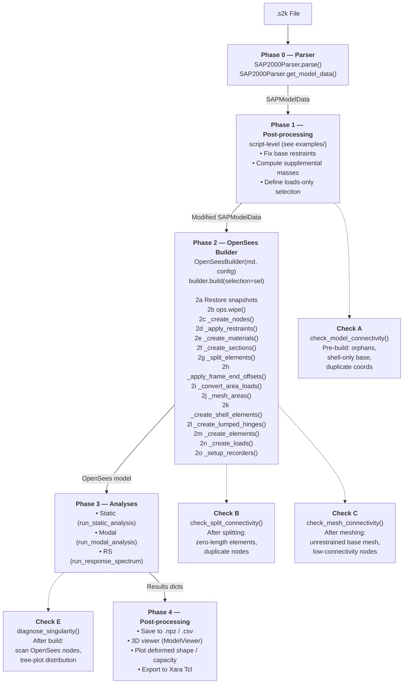

# Analysis Workflow

This document describes the end‑to‑end analysis pipeline for a SAP2000
model, from parsing the `.s2k` export file through to extracting static,
modal, and response‑spectrum results.

---

## Overview



---

## Phase 0 — Parsing (`SAP2000Parser`)

File: `src/fea_toolkit/io/s2k_parser.py`

```python
parser = SAP2000Parser("model.s2k")
parser.parse()                         # raw table data → _raw_tables
md = parser.get_model_data()           # _raw_tables → SAPModelData
```

### What `parse()` does

1. Read file content (tries `utf-8`, `cp1252`, `latin-1` fallback)
2. Split content into tab‑delimited tables (`TABLE: "..."` headers)
3. Parse each table row into `{column_name: value}` dicts
4. Store in `self._raw_tables[table_name] → List[Dict]`

### What `get_model_data()` does

Converts each raw table into dataclass instances:

| Raw table | Dataclass(es) |
|---|---|
| `"OBJECT GEOMETRY"` | `Node` |
| `"JOINT RESTRAINTS"` | `Restraint` |
| `"MATERIAL PROPERTIES"` | `Material` |
| `"FRAME SECTION PROPERTIES"` | `RectangularSection`, `ISection`, … |
| `"AREA SECTION PROPERTIES"` | `ShellSection` (stores `thickness`; `A=I33=I22=J=0`) |
| `"FRAME ASSIGNMENTS"` | `FrameElement` + `FrameAssignments` |
| `"AREA ASSIGNMENTS"` | `AreaElement` + `AreaAssignments` |
| `"AREA MESH ASSIGNMENTS"` | `AreaMesh` |
| `"FRAME END OFFSETS"` | `FrameEndOffset` |
| `"JOINT LOADS"` | `JointLoad` |
| `"FRAME DISTRIBUTED LOADS"` | `FrameDistributedLoad` |
| `"AREA UNIFORM LOADS"` | `AreaUniformLoad` |
| `"LOADS – AREA GRAVITY"` | `AreaGravityLoad` |
| `"LOAD PATHS"` | `LoadPattern` |
| `"LOAD CASES"` | `LoadCase` |
| `"MASS SOURCE"` | `MassSource` |
| `"GROUPS"` | `Group` |
| `"AREA EDGE CONSTRAINT"` | `AreaEdgeConstraint` |

The result is a single `SAPModelData` object containing all parsed data.

---

## Phase 1 — Post‑processing (script level)

The user script (e.g. `local/admin_linear.py`) applies model‑specific
adjustments **before** handing the data to the builder.

```python
# ── Fix base restraints for shell‑only nodes ──────────────────────
# SAP2000 exports [1,1,1,0,0,0] for all base nodes, but ShellMITC4
# has no drilling DOF stiffness — shell‑only base nodes need full fixity.
min_z = min(nd.z for nd in md.nodes.values())
base_ids = {nd.node_id for nd in md.nodes.values() if nd.z == min_z}
# ... identify shell‑only nodes, set md.restraints[nid] = [1,1,1,1,1,1]

# ── Supplementary masses (masonry, finishes) ─────────────────────
# Compute from area × thickness × unit_weight / g
# Add to seismic mass dict

# ── Loads‑only selection ─────────────────────────────────────────
# Areas matching this selection are NOT turned into shell elements.
# Their loads are converted to equivalent frame edge loads instead.
sel = Selection(sections=["brick wall"], element_types=["Area"])

# ── Reduce loads‑only section properties ─────────────────────────
# Optional: set A, I33, I22 to near‑zero so they contribute negligible
# stiffness even if referenced by frame elements.
```

---

## Phase 2 — OpenSees Build (`OpenSeesBuilder.build()`)

File: `src/fea_toolkit/opensees/builder.py`

```python
b = OpenSeesBuilder(md, config)
b.build(selection=sel)
```

The `build()` method follows this **exact order**:

```
 Step │ Method                   │ OpenSees commands                │ Notes
──────┼──────────────────────────┼──────────────────────────────────┼────────────
  2a  │ Restore snapshots        │ —                               │ deep‑copy originals
  2b  │ ops.wipe()               │ ops.wipe()                      │
      │                          │ ops.model('basic','-ndm',3,'-ndf',6)
  2c  │ _create_nodes()          │ ops.node(tag, x, y, z)          │ SAP2000 nodes only
  2d  │ _apply_restraints()      │ ops.fix(tag, ux,uy,uz, rx,ry,rz)
  2e  │ _create_materials()      │ ops.uniaxialMaterial(…)         │
  2f  │ _create_sections()       │ ops.section('Elastic', tag, …)  │ includes ShellSections
  2g  │ _split_elements()        │ geometry.split_elements()       │ 🔗 Check B
  2h  │ _apply_frame_end_offsets()│ rigid‑link records             │
  2i  │ _convert_area_loads()    │ area → frame edge loads         │
  2j  │ _mesh_areas()            │ geometry.mesh_area_elements()   │ 🔗 Check C
      │                          │ ops.fix() for base mesh nodes   │
  2k  │ _create_shell_elements() │ ops.element('ShellMITC4', …)    │
      │                          │ ops.section('ElasticMembranePlateSection', …)
  2l  │ _create_lumped_hinges()  │ zeroLengthSection hinges        │ optional
  2m  │ _create_elements()       │ ops.element('elasticBeamColumn')│ 🔗 Check D
      │                          │ ops.geomTransf('Linear', …)     │
  2n  │ _create_loads()          │ ops.pattern() / ops.load() / …  │ patterns & self‑weight
  2o  │ _setup_recorders()       │ optional opstool recorders      │
```

### Detailed step descriptions

#### 2a–2b — Reset

Restores pristine frame/area/node data from snapshots taken when
the `OpenSeesBuilder` was constructed.  Ensures repeated `build()`
calls always start from the same original geometry.

#### 2c — `_create_nodes()`

Creates an OpenSees node for every `Node` in the SAP2000 model data.
Mesh nodes created later (step 2j) are added to OpenSees as they
are generated.

#### 2d — `_apply_restraints()`

Applies `ops.fix()` for every `Restraint` defined in the SAP2000 model.

#### 2e — `_create_materials()`

Creates `uniaxialMaterial` (e.g. `Concrete01`, `Steel01`) for each
`Material` that has an `E_mod > 0`.  Materials are used both for
frame sections and for `ElasticMembranePlateSection` shell sections (which
extract `E_mod` and Poisson's ratio).

> ⚠️ **Note on shell sections:** `ElasticPlateSection` creates a singular
> stiffness matrix for `ShellMITC4` in OpenSeesPy 3.x.  The builder uses
> `ElasticMembranePlateSection` instead, which provides correct membrane
> + bending stiffness.  See the [Builder Reference](builder_reference.md).

#### 2f — `_create_sections()`

Creates `ops.section('Elastic', tag, E, A, I33, I22, G, J)` for
**every** section, including `ShellSection` types.  For `ShellSection`,
A/I33/I22/J are computed from thickness (since the parsed values are zero).
Shell elements **do not** use these Elastic sections — they use a separate
`ElasticPlateSection` created in step 2k.

#### 2g — `_split_elements()`  *(Connectivity Check B)*

Calls `geometry.split_elements()` to subdivide frame elements at any
intermediate SAP2000 node that lies exactly on the element's segment
(i.e. `AtJoints=True` in the SAP2000 auto‑mesh settings).  Uses a
`SpatialGrid` for fast bounding‑box lookup.

- Original element is marked `.inactive = True`
- Child elements get new element IDs, carry the parent's section assignment
- Distributed loads are split proportionally across children
- Results stored in `self.split_elements`, `self.split_assignments`,
  `self.split_dist_loads`

Frame elements that do NOT have `AtJoints=True` are left unchanged.

#### 2h — `_apply_frame_end_offsets()`

Creates offset nodes and records rigid‑link entries that connect
the physical member ends to the structural nodes.  The rigid links
are created as `elasticBeamColumn` elements with a very stiff section
in step 2m.

#### 2i — `_convert_area_loads()`

For loads‑only areas (those matching the selection), area uniform
loads are converted to equivalent beam‑edge distributed loads.
This is done by finding the frame element that shares each area edge
and allocating the load proportionally.

#### 2j — `_mesh_areas()`  *(Connectivity Check C)*

Calls `geometry.mesh_area_elements()` to subdivide area elements
per the `AreaMesh` settings (`max_size`, `MeshType`).

- Creates sub‑area elements with unique IDs (e.g. `"3_sub_1"`)
- Creates mesh nodes at subdivision points (unique tags)
- Updates `self.model.nodes` with new mesh nodes
- Creates OpenSees nodes for all mesh nodes
- **Automatically** applies `ops.fix(1,1,1,1,1,1)` to any mesh‑created
  node at the base elevation that has no SAP2000 restraint

#### 2k — `_create_shell_elements()`

Creates `ShellMITC4` elements for all meshed area elements that are
**not** in the loads‑only selection.

- Shell sections use `ops.section('ElasticPlateSection', tag, E, nu, thickness, rho)`
  — a separate section tag space from the frame sections.  Uses
  `ElasticMembranePlateSection` (not `ElasticPlateSection` — see note above)
- `ShellMITC4` (quad) or `ShellMITC4` with a repeated last node (tri)
- Creates `frame_tag_map` mapping element IDs to OpenSees tags

#### 2l — `_create_lumped_hinges()`

Optional (activated by `config['hinge_model'] = 'lumped'`).  Replaces
selected frame elements with a three‑part assembly:

```
structural_node_i → hinge_i → elastic_mid → hinge_j → structural_node_j
```

Coincident hinge nodes have translation DOFs tied with `equalDOF` so
only rotations are released.  Hinge backbones use `Hysteretic` material
matched to ASCE 41 rotation limits.

#### 2m — `_create_elements()`  *(Connectivity Check D)*

Creates OpenSees frame elements using either `split_elements` (if
splitting occurred) or the original `frame_elements`.

- Geometric transformation via `ops.geomTransf('Linear', tag, ref_x, ref_y, ref_z)`
  using the SAP2000 angle → reference vector mapping
- Optional brace subdivision with initial imperfections
- Creates rigid‑link elements for end offsets and brace offsets
- Finally calls `ops.element('elasticBeamColumn', tag, node_i, node_j, transf, sec)`

#### 2n — `_create_loads()`

Creates load patterns, time series, and applies loads:

- Joint loads (`ops.load(tag, *components)`)
- Frame distributed loads (converted to nodal loads at integration points)
- Self‑weight (`ops.eleLoad` for each element)
- Area gravity loads (converted to equivalent nodal loads)
- If `pattern_scales` is provided, only the specified patterns
  are created at the given scale factors

#### 2o — `_setup_recorders()`

Optional: configures `opstool` recorders for extracting detailed
element forces and section responses during analysis.

---

## Phase 3 — Analyses

### 3a — Static analysis

```python
res = b.run_static_analysis(pattern_scales={"DEAD": 1.0, "LL": 1.0})
```

Flow:

1. If `pattern_scales is not None` → **rebuilds** the model via
   `self.build(pattern_scales=..., selection=sel)`, which triggers
   the full Phase 2 pipeline with only the specified load patterns
2. Sets up the solver:
   - `ops.constraints('Transformation')`
   - `ops.numberer('RCM')`
   - `ops.system('BandGeneral')` (or `SparseGeneral` via config)
   - `ops.test('NormDispIncr', ...)`
   - `ops.algorithm('Newton')`
   - `ops.integrator('LoadControl', ...)`
3. `ops.analyze(n_sub)` — solves the system
4. Extracts results:
   - `nodal_displacements`: `{node_tag: (dx, dy, dz)}`
   - `nodal_reactions`: `{node_tag: (fx, fy, fz, mx, my, mz)}`
   - `summed_reactions`: total force/moment vector
   - `load_totals`: applied load totals per pattern

### 3b — Modal analysis

```python
modal = b.run_modal_analysis(num_modes=6, eigen_solver="default")
```

- Rebuilds model with the mass‑associated load pattern
- `ops.eigen(num_modes)` via ARPACK (default) or fullGenLapack fallback
- Returns periods, frequencies, mode shapes

### 3c — Response‑spectrum analysis

```python
rs = b.run_response_spectrum_analysis(
    num_modes=12,
    modal_periods=periods,
    spectrum_periods=T_sp,
    spectrum_accels=Sa_sp,
    direction="X",
    damping_ratio=0.05,
)
```

- CQC modal combination
- Returns base shear, base moment, drift ratios

---

## Connectivity Checks

The following check points are built into the workflow to catch modelling
errors early:

| Label | Location | What it checks | Method |
|---|---|---|---|
| **A** | After Phase 1 (pre‑build) | Orphan SAP2000 nodes, shell‑only base nodes, zero‑area sections | `OpenSeesBuilder.check_model_connectivity()` |
| **B** | After `_split_elements()` 2g | Zero‑length split children, duplicate coordinate nodes | `OpenSeesBuilder.check_split_connectivity()` |
| **C** | After `_mesh_areas()` 2j | Base mesh nodes without restraint, perimeter nodes with ≤2 shells | `OpenSeesBuilder.check_mesh_connectivity()` |
| **D** | Before `_create_elements()` 2m | Unassigned frame elements, missing sections | (validated during element creation) |
| **E** | After `build()` before analysis | Full node‑element connectivity summary, tree plot | `OpenSeesBuilder.diagnose_singularity()` |

For details on each check method and its output, see the
[Builder Reference](builder_reference.md).

---

## Data flow summary

```
  .s2k ──→ SAP2000Parser ──→ SAPModelData ──→ OpenSeesBuilder ──→ OpenSees model
                │                  │                  │                  │
            raw tables        dataclass tree     OpenSees ops       in‑memory
                                                commands            analysis

                         ┌──────────────────────────────────────────────────┐
                         │           ModelViewer (plotting/viewer.py)      │
                         │  show_model · overlay_deformed · overlay_forces │
                         │  highlight_elements · highlight_nodes · annotate│
                         │  screenshot · export_html · show               │
                         └──────────────────────────────────────────────────┘
```

The :doc:`ModelViewer </viewer>` can be pointed at either the
``SAPModelData`` or the builder to produce interactive 3D views
for discussion and debugging.  See ``docs/viewer.md`` for the full API.

